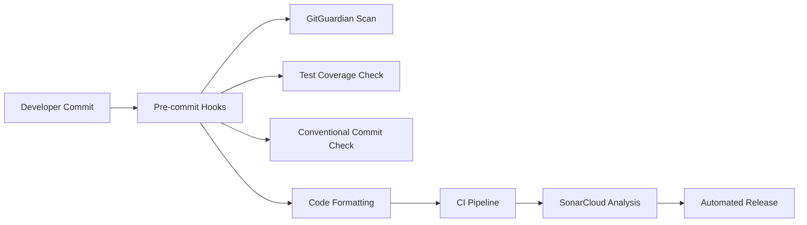

# Acronym Creator

A robust Python CLI tool demonstrating comprehensive CI/CD best practices, security controls, and automated quality gates.

## Purpose

This repository serves as a template/example for teams implementing secure development workflows with:
- **Multi-layer secret detection** using GitGuardian
- **Automated test coverage enforcement** (80% minimum threshold)
- **Code quality analysis** with SonarCloud integration
- **Automated semantic versioning** and release management

The project includes a functional acronym generation CLI built with Click and comprehensive test coverage.

## Features

### 🔒 Comprehensive Security & Quality Guardrails

#### Multi-Layer Secret Protection
- **Pre-commit GitGuardian**: Scans staged changes before commits
- **CI Repository History Scan**: Scans entire git history for secrets
- **Blocks pipeline on detection**: Prevents secrets from reaching production

#### Code Quality Enforcement
- **Black Code Formatting**: Consistent Python code style
- **Flake8 Linting**: PEP 8 compliance and code quality checks
- **Test Coverage**: 80% minimum threshold enforced at commit and CI
- **SonarCloud Analysis**: Code quality, security, and technical debt assessment

#### Commit Standards
- **Conventional Commits**: Enforced format for automated versioning
- **Pre-commit Validation**: All quality checks run before commit acceptance
- **CI Re-validation**: Clean environment re-runs of all quality checks

### 🚀 Five-Stage CI/CD Pipeline
1. **Lint and Test**: Pre-commit hooks + comprehensive testing
2. **GitGuardian History Scan**: Full repository secret detection
3. **SonarCloud**: Code quality analysis (main branch only)
4. **Build**: Package validation and artifact generation
5. **Release**: Automated semantic versioning (main branch only)

### 🧪 Python Package
- **Click CLI Framework**: Professional command-line interface
- **Comprehensive Testing**: Unit tests with pytest and coverage reporting
- **Package Structure**: Standard Python package with entry points
- **Development Tools**: Pre-commit hooks, linting, and type checking

## Quick Start

### 1. Local Development Setup

```bash
# Create and activate Python virtual environment
python3 -m venv venv
source venv/bin/activate

# Install the package with development dependencies
pip install -e ".[dev]"

# Install pre-commit hooks
pre-commit install
pre-commit install --hook-type commit-msg

# Test the CLI
acronymcreator "Hello World"  # Output: HW
```

### 2. Running Tests

```bash
# ALWAYS activate virtual environment first
source venv/bin/activate

# Run tests with coverage (must maintain 80% minimum)
python -m pytest --cov=src --cov-report=term-missing --cov-fail-under=80

# Run all pre-commit hooks (includes coverage check)
pre-commit run --all-files

# Test only the coverage hook
pre-commit run pytest --all-files
```

### 3. Development Workflow

```bash
# Make your changes
git add .

# Commit with conventional format (triggers all quality checks)
git commit -m "feat: add new acronym generation feature"

# Push to trigger CI pipeline
git push
```

The pre-commit hooks will automatically:
- ✅ Run tests with coverage enforcement (80% minimum)
- ✅ Scan for secrets with GitGuardian
- ✅ Validate conventional commit format
- ✅ Fix formatting and lint issues
- ❌ Block the commit if any check fails

## Architecture Overview

### Multi-Layer Security Pipeline



**Layer 1 - Local Pre-commit**:
- GitGuardian secret scanning
- Test coverage enforcement (80% minimum)
- Conventional commit validation
- Code formatting and linting

**Layer 2 - CI Pipeline**:
- Re-runs all pre-commit checks in clean environment
- Generates coverage reports for SonarCloud
- Validates build and package integrity

**Layer 3 - SonarCloud Quality Gate**:
- Code quality analysis
- Security vulnerability detection
- Coverage verification
- Technical debt assessment

**Layer 4 - Automated Release**:
- Semantic version calculation
- Changelog generation
- GitHub release creation
- Package publishing (when configured)

## Configuration Files

### Key Configuration Files

| File | Purpose |
|------|---------|
| `.pre-commit-config.yaml` | Pre-commit hooks including GitGuardian and pytest |
| `pytest-precommit.ini` | Pytest configuration for test execution |
| `.coveragerc` | Coverage.py configuration with 80% threshold |
| `pyproject.toml` | Python package configuration and dependencies |
| `.github/workflows/ci.yml` | Complete CI/CD pipeline definition |
| `.releaserc.json` | Semantic-release configuration |
| `sonar-project.properties` | SonarCloud analysis configuration |

### Environment Variables

**Local Development**:
```bash
# Required for GitGuardian secret scanning
export GITGUARDIAN_API_KEY=your_api_key_here
```

**CI/CD Secrets** (configured in GitHub repository settings):
- `GIT_GUARDIAN_API_KEY`: GitGuardian API key for CI pipeline
- `SONAR_TOKEN`: SonarCloud integration token

## Automated Guardrails & Quality Controls

This repository implements comprehensive automated guardrails to ensure code quality, security, and reliability at every stage of development.

### Pre-commit Checks (Local Protection)

Every commit attempt triggers automated validation checks that **block the commit** if standards are not met:

#### Security Scanning
- **GitGuardian Secret Detection**: Scans staged changes for API keys, tokens, passwords, and certificates
- **Immediate Feedback**: Developers know about security issues before code enters the repository

#### Code Quality
- **Black Code Formatting**: Automatically formats Python code to consistent style
- **Flake8 Linting**: Enforces PEP 8 compliance and detects code quality issues
- **Test Coverage**: Ensures 80% minimum coverage before allowing commits
- **File Hygiene**: Removes trailing whitespace, ensures proper file endings

#### Commit Standards
- **Conventional Commits**: Validates commit message format for automated versioning
- **YAML Validation**: Checks configuration files for syntax errors

### CI Pipeline Re-validation (Clean Environment)

The **"Lint and Test"** CI stage re-runs all pre-commit checks in a clean environment, providing additional value:

#### Why Re-run Pre-commit Checks in CI?
1. **Environment Consistency**: Validates that code works in clean, reproducible environment
2. **Bypass Protection**: Catches issues when developers use `git commit --no-verify`
3. **Dependency Verification**: Ensures all dependencies are properly declared
4. **Cross-platform Validation**: Tests on different OS/Python versions than developer machines
5. **Audit Trail**: Provides official record of quality compliance for compliance/governance

#### CI-Specific Benefits
- **Artifact Generation**: Creates coverage reports for downstream analysis
- **Parallel Execution**: Runs tests faster with CI resources
- **Integration Testing**: Validates package installation and CLI functionality
- **Documentation**: Maintains build logs and test reports

### GitGuardian Repository History Scanning

Beyond pre-commit secret detection, the CI pipeline includes comprehensive repository scanning:

#### Full History Analysis
- **Complete Git History**: Scans every commit, branch, and file in repository history
- **Historical Secrets**: Detects secrets that were committed and later removed
- **Commit-by-Commit**: Identifies exactly which commits contain secrets

#### Why Scan History vs. Just Files?
1. **Complete Coverage**: Files can be deleted but secrets remain in git history
2. **Compliance Requirements**: Many security standards require historical analysis
3. **Incident Response**: Helps identify when secrets were introduced and their scope
4. **Supply Chain Security**: Ensures no secrets exist anywhere in the codebase lifecycle

#### Technical Implementation
```bash
# Current files only (limited protection)
ggshield secret scan path . --recursive

# Complete history (comprehensive protection)
ggshield secret scan repo .
```

### Pipeline Failure Handling

The CI pipeline implements strict failure handling:

- **Sequential Execution**: Each stage waits for previous stage completion
- **Fast Failure**: Pipeline stops immediately when any stage fails
- **No Partial Deployments**: Release only occurs if ALL quality gates pass
- **Clear Feedback**: Detailed logs show exactly what failed and why

### Quality Gate Integration

#### SonarCloud Analysis (Main Branch)
- **Code Quality Metrics**: Maintainability, reliability, security ratings
- **Coverage Verification**: Validates 80% coverage requirement
- **Technical Debt**: Identifies areas needing refactoring
- **Security Hotspots**: Detects potential vulnerabilities

#### Automated Release Gates
- **Version Calculation**: Based on conventional commit analysis
- **Changelog Generation**: Automatic release notes from commit history
- **Artifact Publishing**: Only occurs after all quality gates pass

## Test Coverage Enforcement

This repository enforces **80% minimum test coverage** at multiple levels:

### Pre-commit Hook
- Automatically runs on every commit attempt
- Uses `python -B -m pytest -c pytest-precommit.ini -p no:cacheprovider`
- Blocks commits if coverage drops below 80%
- Generates no cache files to avoid "files modified" errors

### Configuration
- **`.coveragerc`**: Main coverage configuration with `data_file = /tmp/.coverage_precommit`
- **Branch coverage enabled**: Comprehensive testing of all code paths
- **Exclusion patterns**: Common patterns like `pragma: no cover`, `__repr__`, etc.

### Testing Commands
```bash
# Run tests with coverage manually
python -m pytest --cov=src --cov-report=term-missing --cov-fail-under=80

# Test the pre-commit hook
pre-commit run pytest --all-files
```

## Semantic Versioning & Releases

Fully automated versioning based on [Conventional Commits](https://www.conventionalcommits.org/):

| Commit Type | Version Bump | Example |
|-------------|--------------|---------|
| `feat:` | Minor | 1.0.0 → 1.1.0 |
| `fix:` | Patch | 1.0.0 → 1.0.1 |
| `feat!:` or `BREAKING CHANGE:` | Major | 1.0.0 → 2.0.0 |
| `docs:`, `style:`, `refactor:`, `test:`, `chore:` | None | No release |

**Release Process**:
1. Push to `main` branch triggers semantic-release
2. Analyzes commits since last release
3. Calculates next version number
4. Generates changelog
5. Creates GitHub release with git tag

## CLI Usage

The acronym generator CLI provides several options:

```bash
# Basic usage
acronymcreator "Hello World"                    # Output: HW

# Include articles and common words
acronymcreator "The Quick Brown Fox" --include-articles  # Output: TQBF

# Lowercase output
acronymcreator "Hello World" --lowercase         # Output: hw

# Get help
acronymcreator --help

# Check version
acronymcreator --version
```

## Troubleshooting

### Common Issues

**Coverage Below 80%**:
```bash
# Add tests for uncovered code paths
# Check coverage report for missing lines
python -m pytest --cov=src --cov-report=html
open htmlcov/index.html
```

**Pre-commit Hook Failures**:
```bash
# Re-run hooks after fixing issues
pre-commit run --all-files

# Update hook dependencies
pre-commit autoupdate
```

**GitGuardian API Issues**:
```bash
# Test GitGuardian scanning specifically
ggshield secret scan pre-commit

# Check API key is set
echo $GITGUARDIAN_API_KEY
```

### Pipeline Debugging

**SonarCloud Quality Gate Failures**:
- Check the "Check Quality Gate Status" step in CI logs
- Review detailed metrics for failed conditions
- Fix issues systematically and re-run analysis

**Semantic Release Issues**:
- Ensure commit messages follow conventional format
- Check repository URL matches in `.releaserc.json`
- Verify GitHub token permissions for releases

## Contributing

1. Fork the repository
2. Create a feature branch: `git checkout -b feat/new-feature`
3. Make changes with proper test coverage (≥80%)
4. Commit using conventional format: `git commit -m "feat: add new feature"`
5. Push and create a pull request
6. All quality gates must pass before merge

## License

MIT License - see [LICENSE](LICENSE) file for details.
